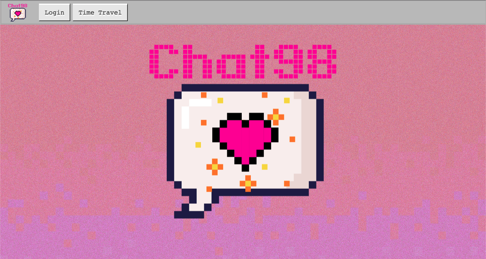
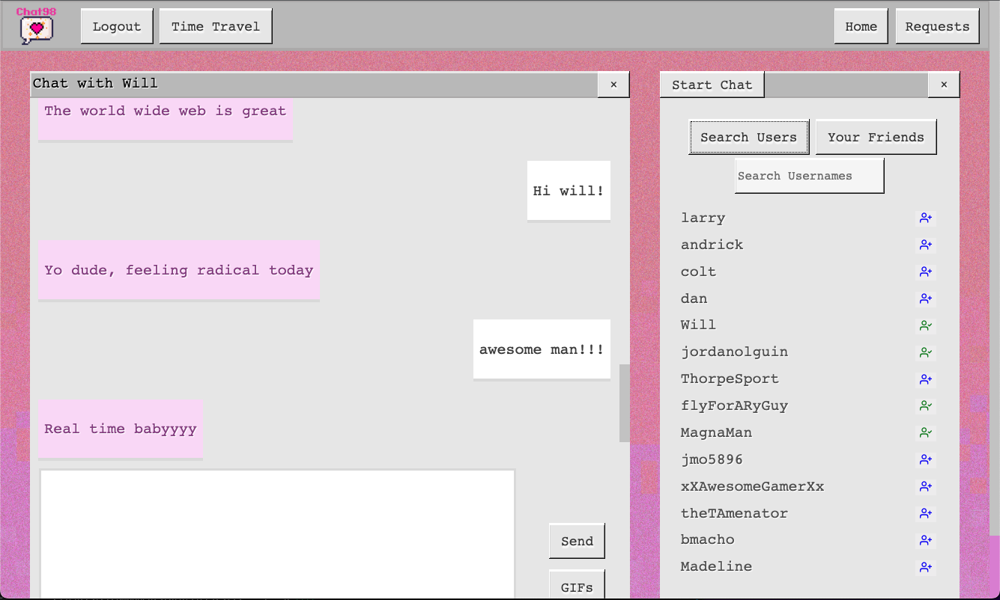
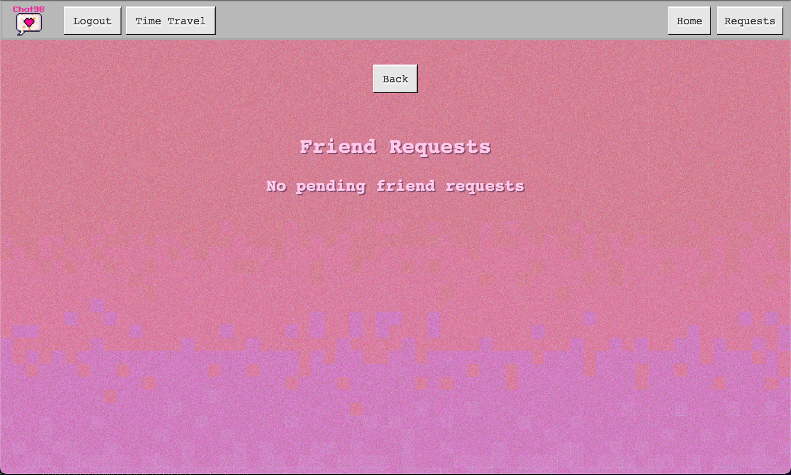

# Chat98

Welcome to Chat 98, where we bring back the nostalgic charm of instant messaging from the '90s in a modern and intuitive way. Connect with friends, send GIFs, and have a blast as if it's 1995!

## Installation

To get started, simply navigate to [Chat 98](https://chat98-a21833346cf4.herokuapp.com/).

## Usage

1. Sign up or log in to the app.
2. Send friend requests and start chatting - it's that simple! Just follow the prompts on the screen.

## Contributors

Chat 98 was created with love by:

- [Andrick Siegmund](https://github.com/Paulsig007)
- [Jordan Olguin](https://github.com/jordanolguin)
- [Madeline Moore](https://github.com/MsJamesM)
- [Derek Szczepanik](https://github.com/Lone1ne)
- [Will Brown](https://github.com/TrueWillB)

## Contributing

We welcome pull requests! If you plan to make significant changes, please open an issue first to discuss your ideas. Remember to update any relevant tests as well.

## License

This project is licensed under the [MIT License](https://choosealicense.com/licenses/mit/). Feel free to review the license for more details.
